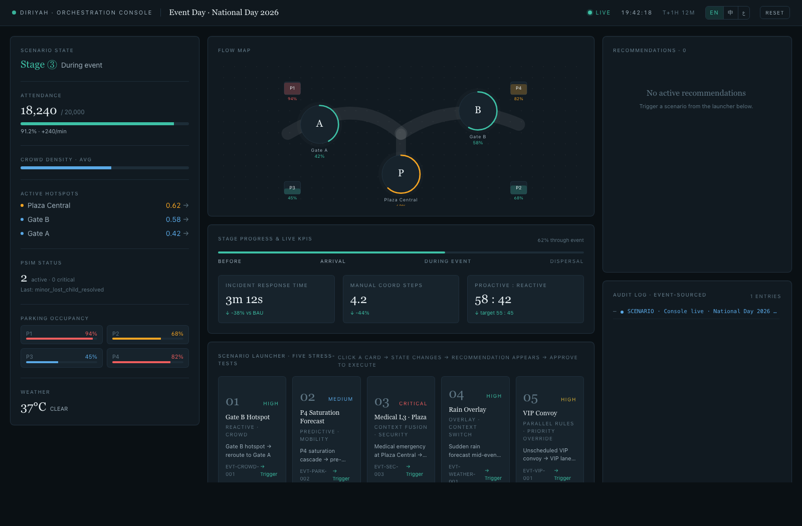
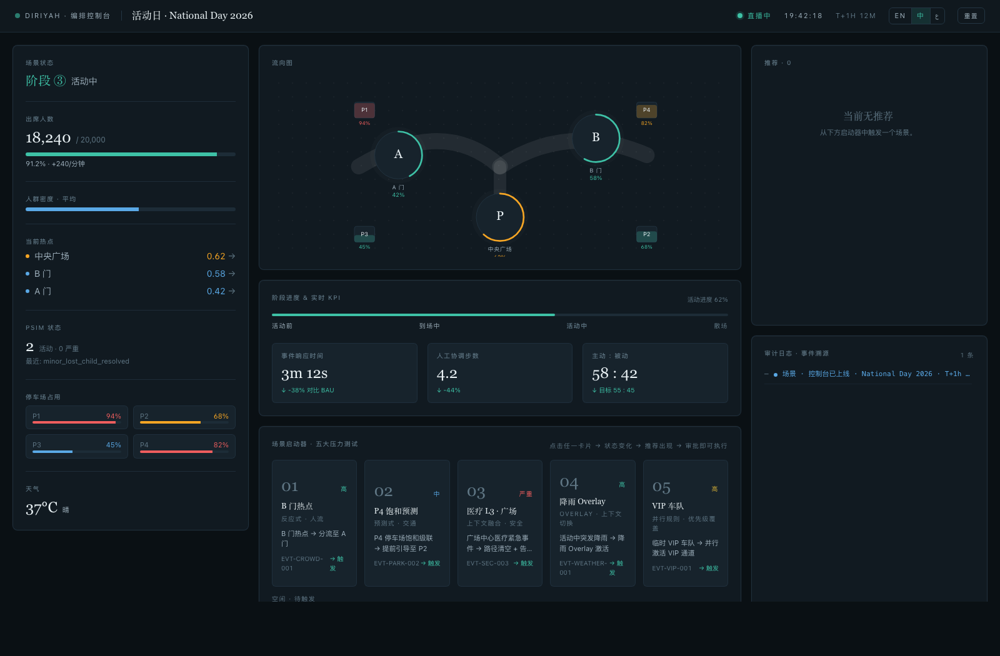
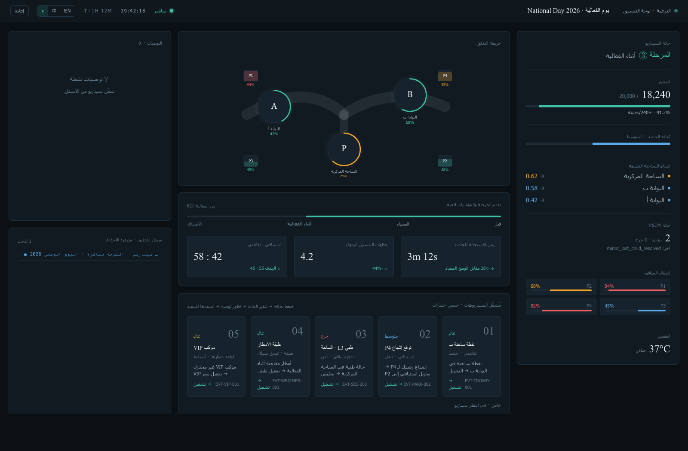

# Diriyah · Event Day Operations — Orchestration Console

> A live, interactive demo of the **Scenario Orchestration Layer** for the Diriyah smart city — Pilot A · Event Day Operations.
>
> **Language** · **English** · [简体中文](./README.zh-CN.md)

   

---

## 0 · Product preview



*Operator Console at baseline · National Day 2026 · T+1h 12m. Four regions: scenario state (left), flow map + KPIs + scenario launcher (centre), recommendations + audit log (right).*

### Trilingual UI — English · 简体中文 · العربية (RTL)

The console ships with **three languages**. Arabic switches the whole layout to right-to-left; numbers and timestamps stay left-to-right inside it. Switch from the header (`EN` / `中` / `ع`) or via a deep link like `?lang=zh`.

<table>
  <tr>
    <td align="center" width="33%"><br/><sub><b>简体中文</b></sub></td>
    <td align="center" width="33%"><br/><sub><b>العربية · RTL</b></sub></td>
    <td align="center" width="33%"><br/><sub><b>English</b></sub></td>
  </tr>
</table>

---

## 1 · What this is

This is a fully interactive **Operator Console** demo that turns the Pilot A proposal into something a prospect can *see and click through*. Every pixel maps back to a specific section of the business & logic deep-dive PDF:

- Four-region operator console — Figure 2 of the PDF
- Five stress-test scenarios — §10 of the PDF (reactive crowd, predictive parking, medical fusion, rain overlay, VIP parallel rules)
- Rule fire → recommendation → operator approval → cross-system fan-out → ACKs → auto-rollback — §08 sequence
- Event-sourced audit log — §08
- Live KPI deltas vs BAU — §09

Nothing calls a real backend. The whole thing is a **scripted scenario player** designed to be rock-solid on stage and to make the orchestration story legible in 90 seconds.

---

## 2 · Screens

A clean, dark ops-console aesthetic matching the PSIM / control-room style referenced in the proposal.

```
┌─ Header ────────────────────────────────────────────────────────────────────┐
│  DIRIYAH · ORCHESTRATION CONSOLE     Event Day · National Day 2026     LIVE │
├─────────────┬──────────────────────────────────────────┬────────────────────┤
│ Scenario    │   Flow Map  (A / B / Plaza + P1–P4)      │  Recommendations   │
│  State      │                                          │  · pending/firing  │
│ Attendance  ├──────────────────────────────────────────┤  · approve/reject  │
│ Hotspots    │   Stage Progress + 3 live KPIs           │                    │
│ PSIM        ├──────────────────────────────────────────┼────────────────────┤
│ Parking     │   Scenario Launcher · 5 stress-tests     │   Audit Log        │
│ Weather     │                                          │   · event-sourced  │
└─────────────┴──────────────────────────────────────────┴────────────────────┘
```

---

## 3 · Five scenarios

Each scenario card in the launcher triggers a scripted timeline: state mutates → rule matches → recommendation card appears → operator clicks approve → 3-channel fan-out with ACKs → auto-rollback when thresholds clear.

| # | Scenario | Rule | Priority | What it shows |
|---|---|---|---|---|
| 01 | Gate B hotspot → reroute to Gate A | `EVT-CROWD-001` | HIGH | The basic closed loop, rollback < 30 s |
| 02 | P4 saturation forecast → pre-empt to P2 | `EVT-PARK-002` | MEDIUM | Predictive value with explicit trade-off |
| 03 | Medical L3 at Plaza Central | `EVT-SEC-003` | **CRITICAL** | Context fusion + **automatic alert suppression** of MEDIUM rules |
| 04 | Sudden rain overlay | `EVT-WEATHER-001` | HIGH · BATCH | Overlay-weights-don't-replace-rules pattern |
| 05 | Unscheduled VIP convoy | `EVT-VIP-001` | HIGH · PARALLEL | Priority override without disrupting regular flow |

---

## 4 · Tech stack

- **Next.js 14** (App Router) + **TypeScript 5**
- **Tailwind CSS 3.4** — custom token palette mirroring the PDF (dark slate + teal accent + gold VIP)
- **React Reducer + Context** — no external state lib, no backend, no websockets
- All scenarios run in-browser as async timelines; each mutates the single canonical `ScenarioState` object (mirror of §04 of the PDF)

Key source layout:

```
app/
  layout.tsx          — root
  page.tsx            — the console
  globals.css         — tailwind + tokens
components/
  Header.tsx          — LIVE clock + reset
  LeftPanel.tsx       — Scenario State
  FlowMap.tsx         — SVG A/B/P + parking + divert arcs
  StageProgress.tsx   — stage bar + 3 KPIs
  Recommendations.tsx — cards, approve/reject, fan-out
  AuditLog.tsx        — event-sourced list
  ScenarioLauncher.tsx— 5 one-click triggers
  ui.tsx              — small shared primitives
lib/
  types.ts            — domain model
  initialState.ts     — baseline state + scenario descriptors
  scenarios.ts        — 5 scripted timelines + post-approval effects
  store.tsx           — reducer + provider
```

---

## 5 · Run it locally

Requires **Node 18+**.

```bash
# install
npm install

# dev
npm run dev
# → http://localhost:3000

# production build
npm run build
npm run start
```

That's it. No env vars, no services, no database.

---

## 6 · Demo script (recommended order)

When showing a prospect, the most persuasive sequence is:

1. **Let the console load** — explain the four regions and the baseline KPIs.
2. **Click Scenario 01** — the easiest closed loop. Point out fan-out to 3 channels and auto-rollback.
3. **Click Scenario 02** — introduce predictive value ("we acted 12 min before P4 saturated").
4. **Click Scenario 03** — the strongest slide. Note the SUPPRESSION chip and how the MEDIUM P4 card greys out when a CRITICAL medical event lands.
5. **Click Scenario 04** — show that rain is an *overlay*, not a replacement playbook.
6. **Click Scenario 05** — show that VIP runs *in parallel* and doesn't freeze regular arrivals.
7. **Scroll the audit log** — every decision, ACK, suppression, rollback is event-sourced.

Total demo time: **≈ 4 minutes**, all driven from the single console page.

---

## 7 · What this demo is *not*

Kept deliberately minimal so the story stays legible:

- No real MQTT broker. The bus is modeled inside the browser.
- No real write adapters. The 4 channels (VMS / App Push / Access / PSIM Notify) log simulated ACKs with plausible latencies.
- No authentication, no role switching. All users are the "Ops Lead".
- No persistence — refresh resets state.

All of this is deliberate. A live demo needs to be unbreakable, fast, and to tell one story cleanly. The engineering proposal in the PDF covers the production architecture.

---

## 8 · Mapping to the proposal PDF

| Console area | PDF section |
|---|---|
| Header (LIVE / event clock / elapsed T+…) | §07 |
| Left panel — attendance, hotspots, PSIM, parking, weather | §04 Scenario State |
| Flow Map — A/B/Plaza/Parking zones | §07, §10 Scenarios 01/03 |
| Stage Progress + 3 KPIs | §05, §09 |
| Recommendations — priority, impact preview, trade-off, confidence, channels | §06, §07 |
| Approve → fan-out → ACK → EXECUTED | §08 sequence diagram |
| Rollback on threshold clear | §02 ④ + §10 |
| Audit Log | §08 |
| 5 scenario launcher | §10 |

---

## 9 · License

For discussion and demonstration purposes only. Not for production use.

© 2026 · Prepared for the Diriyah pilot conversation.
